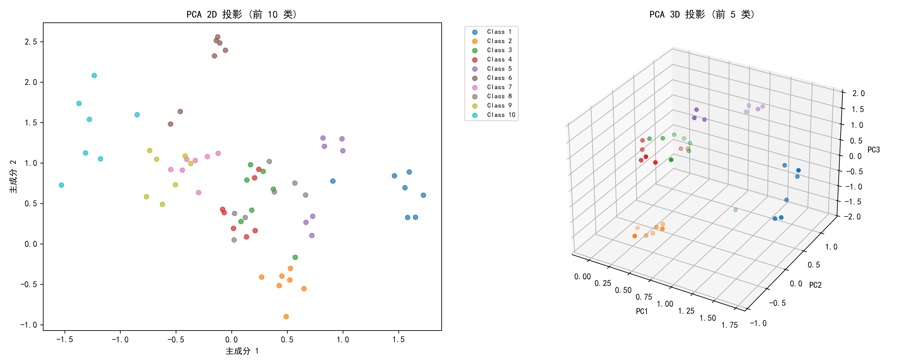
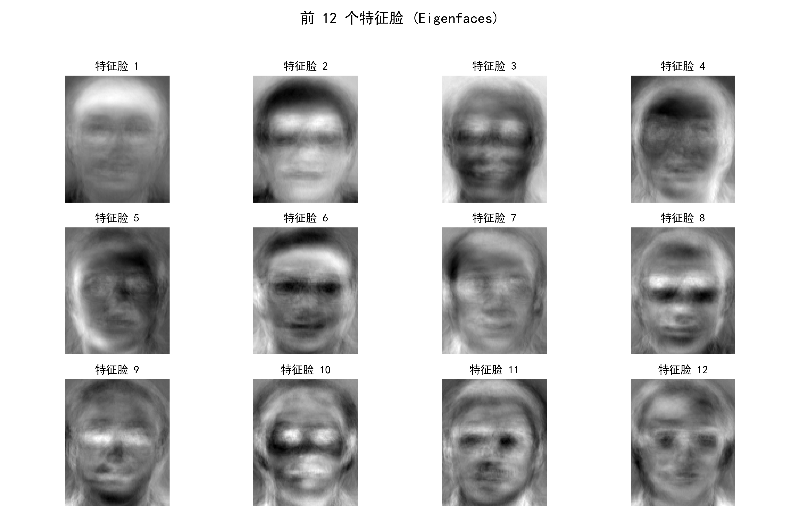
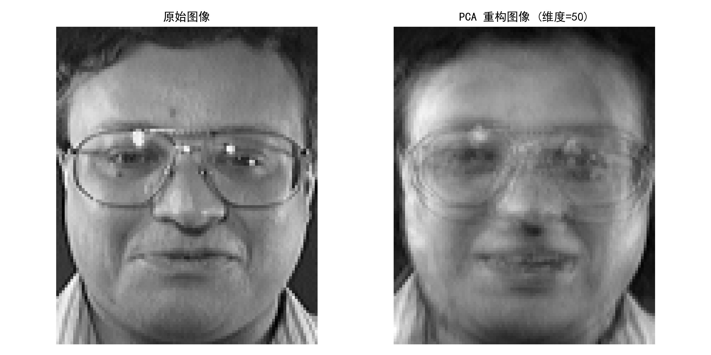
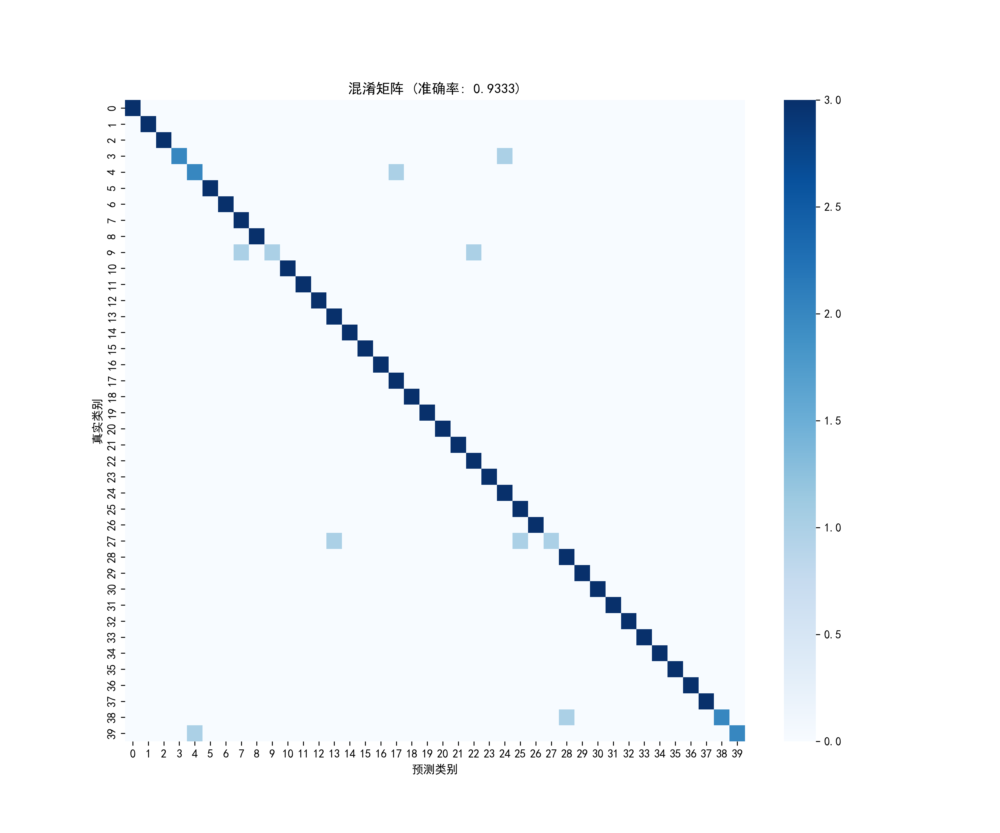
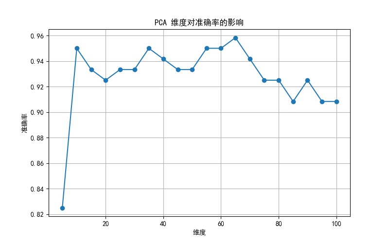
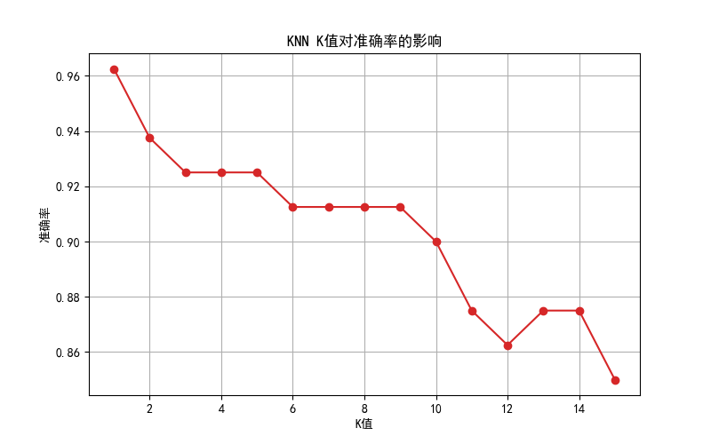
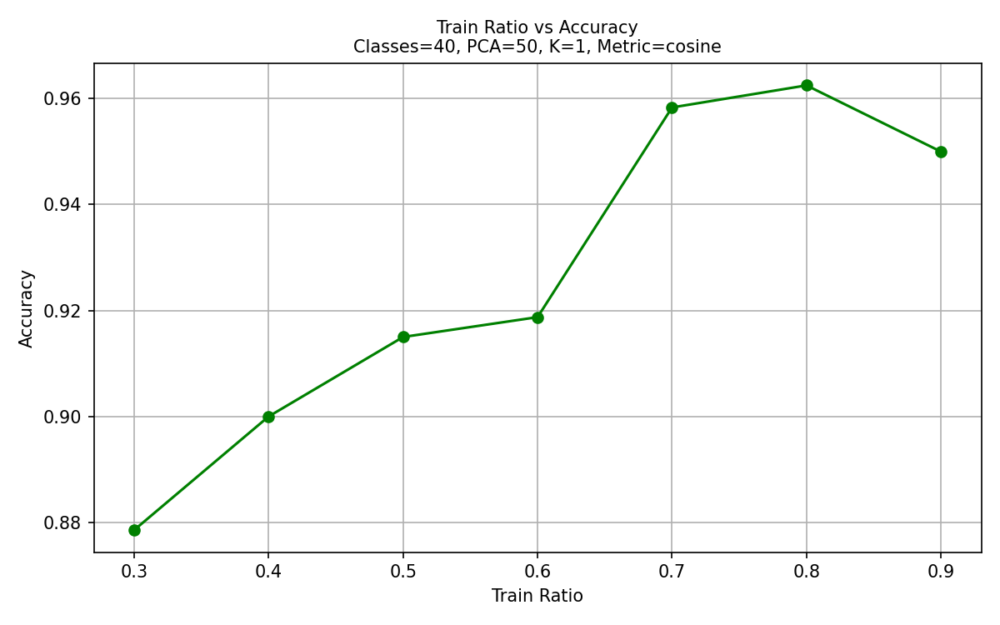
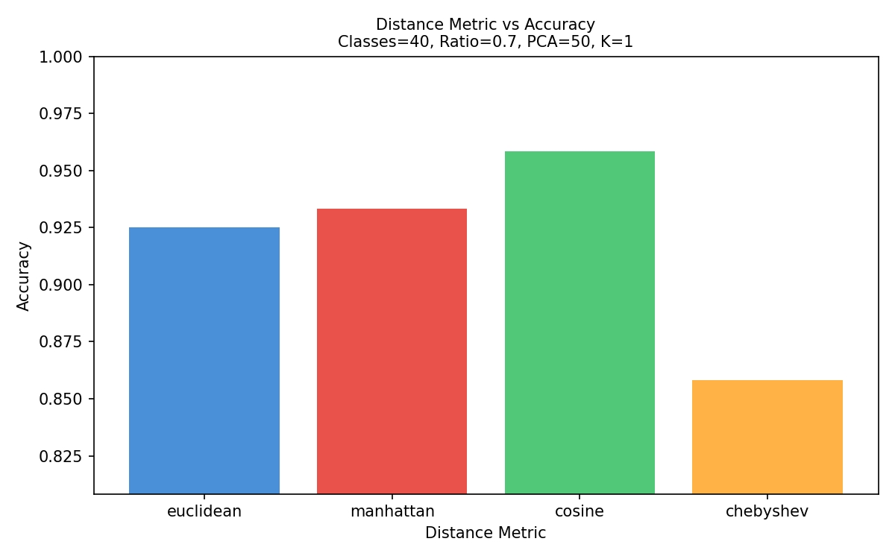
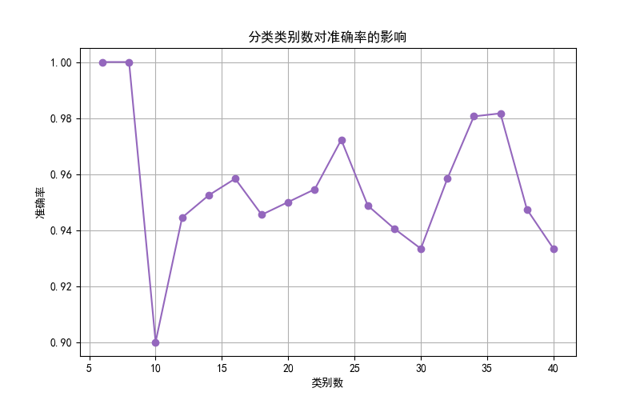

# 实验4：PCA + KNN 人脸识别 (更新版)

## 1. 实验背景与任务
本实验基于 **ORL 人脸库**，旨在通过 **主成分分析 (PCA)** 进行特征降维，并结合 **K-最近邻 (KNN)** 分类器实现高效的人脸识别。

### 数据集概况
| 项目 | 取值 |
| --- | --- |
| 数据集 | ORL 人脸库 |
| 类别总数 | 40 类 |
| 每类样本数 | 10 张 |
| 图像尺寸 | 92 × 112 |
| 原始特征维度 | 10304 维 |

---

## 2. 实验配置与基准参数
默认实验参数定义在 `lab4.py` 的 `CONFIG` 字典中，基准配置如下：

| 参数 | 默认值 | 说明 |
| --- | --- | --- |
| `num_classes` | 40 | 参与分类的人脸类别数 |
| `train_ratio` | 0.7 | 训练集比例 (280张训练, 120张测试) |
| `pca_components` | 50 | PCA 降维后的特征维度 |
| `knn_k` | 1 | KNN 邻居数 |
| `knn_metric` | `cosine` | KNN 距离度量方式 |
| `random_seed` | 42 | 随机种子，确保实验可重复 |

---

## 3. 可视化分析

### 3.1 特征空间投影 (PCA 2D & 3D)
通过 PCA 将高维人脸数据投影到低维空间。左图展示了前 10 类在 2D 平面上的分布，右图展示了前 5 类在 3D 空间中的聚类情况。可以看到，同类样本在降维后依然保持了较好的聚集性。

### 3.2 特征脸 (Eigenfaces) 展示
提取出的前 12 个主成分（特征脸）。这些图像代表了人脸数据集中方差最大的方向，捕捉了人脸的主要轮廓和光影特征。

### 3.3 图像重构对比
使用 50 维主成分对原始图像进行重构。对比可见，虽然丢失了部分细节，但 50 维特征已足以保留人脸的关键识别信息。

### 3.4 混淆矩阵
基准配置下的分类结果。对角线上的深色块表示预测正确的样本，整体准确率维持在较高水平。

---

## 4. 参数扫描与性能优化

为了探究不同参数对识别准确率的影响，程序对以下维度进行了全扫描：

### 4.1 PCA 维度与 KNN K值
*   **PCA 维度**：维度过低（<20）时准确率较低，随着维度增加，准确率在 40-70 维达到稳定峰值。
*   **KNN K值**：对于小样本集，`K=1` 表现最佳，随着 K 值增大，准确率呈下降趋势。

| PCA 维度影响 | KNN K值影响 |
| :---: | :---: |
|  |  |

### 4.2 训练比例与距离度量
*   **训练比例**：增加训练样本通常能显著提升模型性能，0.7-0.8 是较为理想的平衡点。
*   **距离度量**：`cosine` (余弦距离) 在人脸识别任务中优于欧氏距离和曼哈顿距离，而 `chebyshev` 表现最差。

| 训练集比例影响 | 距离度量对比 |
| :---: | :---: |
|  |  |

### 4.3 分类类别数
随着分类类别数的增加，任务难度提升，准确率会出现一定波动，但在 40 类全集下依然能保持优秀的识别效果。

---

## 5. 实验结论
1.  **降维有效性**：PCA 能将 10304 维特征压缩至 50 维左右，同时保留约 95% 以上的识别准确率。
2.  **最优配置**：在 ORL 数据集上，采用 **余弦距离**、**K=1**、**PCA维度=50**、**训练比=0.7** 是一个非常稳健的参数组合。
3.  **可视化意义**：特征空间投影和图像重构直观地证明了 PCA 在提取核心特征方面的强大能力。
